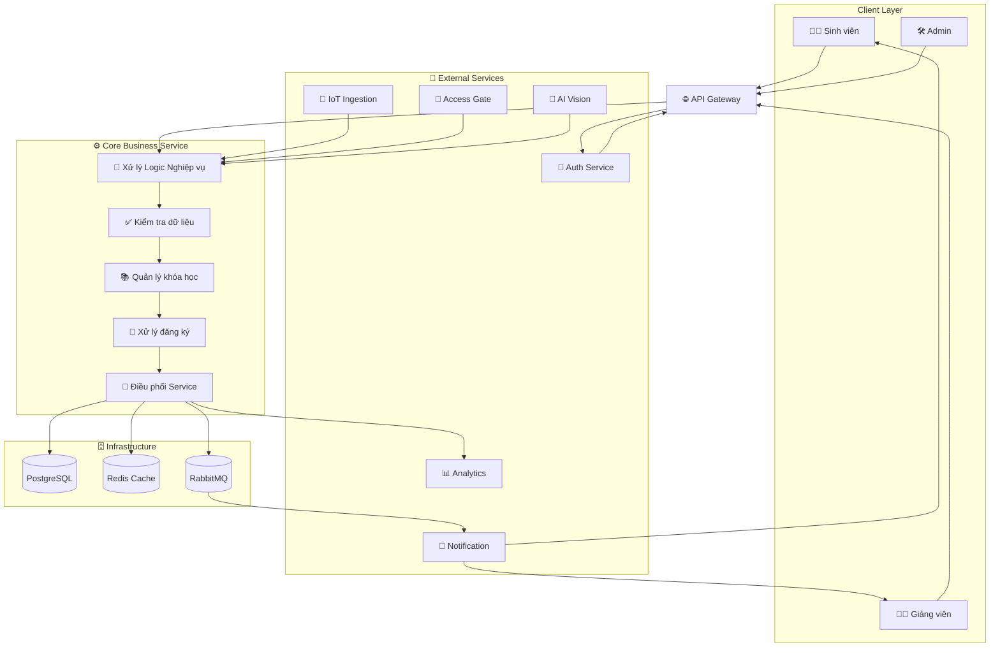

# SERVICE BOUNDARY – CORE BUSINESS SERVICE

## 1. Thông tin nhóm

* **Tên nhóm:** 6B
* **Lớp:** CNTT 17-12
* **Thành viên:** Trương Hữu Vinh, Đỗ Quang Minh, Đinh Ngọc Chính, Hà Quang Dự
* **Service phụ trách:** Core Business Service
* **Sản phẩm tổng thể:** Smart Campus Ecosystem (Hệ sinh thái Campus thông minh)

---

# 2. Giới thiệu Service

Nhóm phụ trách xây dựng **Core Business Service** – service trung tâm của hệ thống Smart Campus Ecosystem.

Service này đóng vai trò:

* Xử lý logic nghiệp vụ chính
* Điều phối dữ liệu giữa các service
* Kiểm tra điều kiện nghiệp vụ
* Quản lý dữ liệu khóa học và đăng ký
* Tổng hợp dữ liệu từ các hệ thống AI, IoT và Access Control

Core Business Service được xem là “bộ não xử lý nghiệp vụ” của toàn bộ hệ thống.

---

# 3. Actor

Các đối tượng tương tác với service gồm:

| Actor                | Vai trò                                  |
| -------------------- | ---------------------------------------- |
| Sinh viên            | Đăng ký khóa học, xem thông tin khóa học |
| Giảng viên           | Tạo/cập nhật nội dung khóa học           |
| Admin                | Quản lý hệ thống và dữ liệu              |
| Auth Service         | Xác thực người dùng                      |
| Notification Service | Gửi email/thông báo                      |
| Analytics Service    | Phân tích dữ liệu                        |

---

# 4. System Boundary

## 4.1 Phần nhóm phụ trách

Core Business Service chịu trách nhiệm:

* Xử lý logic nghiệp vụ trung tâm
* Kiểm tra dữ liệu đầu vào
* Xử lý đăng ký khóa học
* Quản lý trạng thái nghiệp vụ
* Điều phối luồng xử lý giữa các service
* Tương tác với database
* Gửi event sang các service khác

---

## 4.2 Phần nhóm KHÔNG phụ trách

Core Business Service không xử lý:

* Giao diện người dùng (Frontend)
* Xác thực tài khoản
* Gửi email/thông báo trực tiếp
* Điều hướng request tại API Gateway
* Phân tích dữ liệu chuyên sâu

Các chức năng trên được thực hiện bởi các service chuyên biệt khác.

---

# 5. Service Boundary

## 5.1 Trách nhiệm chính của service

Core Business Service có nhiệm vụ:

* Quản lý dữ liệu nghiệp vụ
* Điều phối xử lý giữa các service
* Kiểm tra điều kiện nghiệp vụ
* Lưu trữ và cập nhật dữ liệu
* Trả kết quả xử lý cho client
* Kích hoạt xử lý bất đồng bộ thông qua Message Queue

---

## 5.2 Ví dụ nghiệp vụ

### Ví dụ: Sinh viên đăng ký khóa học

Quy trình xử lý:

1. Sinh viên gửi request đăng ký
2. API Gateway chuyển request vào hệ thống
3. Auth Service xác thực người dùng
4. Core Business Service kiểm tra:

   * Sinh viên có đủ điều kiện không
   * Môn học còn chỗ hay không
5. Hệ thống lưu dữ liệu đăng ký
6. Gửi event sang Notification Service
7. Trả kết quả về cho client

---

# 6. Input / Output

## 6.1 Input

Dữ liệu đầu vào gồm:

* HTTP Request từ client
* Request từ các service khác
* Token xác thực từ Auth Service
* Dữ liệu từ IoT / AI / Access Control

### Ví dụ request

```json
POST /enroll
{
  "studentId": 1,
  "courseId": 10
}
```

---

## 6.2 Output

Dữ liệu đầu ra gồm:

* JSON Response
* Trạng thái xử lý
* Dữ liệu khóa học
* Event gửi sang service khác

### Ví dụ response

```json
{
  "status": "success",
  "message": "Enroll successful"
}
```

---

# 7. API dự kiến

| Method | Endpoint      | Mục đích                    |
| ------ | ------------- | --------------------------- |
| GET    | /health       | Kiểm tra trạng thái service |
| GET    | /courses      | Lấy danh sách khóa học      |
| GET    | /courses/{id} | Lấy chi tiết khóa học       |
| POST   | /courses      | Tạo khóa học mới            |
| POST   | /enroll       | Đăng ký khóa học            |
| GET    | /enrollments  | Xem danh sách đăng ký       |
| PUT    | /courses/{id} | Cập nhật khóa học           |
| DELETE | /courses/{id} | Xóa khóa học                |

---

# 8. Phụ thuộc giữa các Service

## 8.1 Service kết nối đến Core Business Service

| Service             | Mục đích                      |
| ------------------- | ----------------------------- |
| API Gateway         | Chuyển tiếp request từ client |
| Frontend Web/Mobile | Gửi yêu cầu nghiệp vụ         |
| Internal Services   | Gửi request xử lý nghiệp vụ   |

---

## 8.2 Core Business Service kết nối tới

| Service               | Vai trò                         |
| --------------------- | ------------------------------- |
| Auth Service          | Xác thực người dùng             |
| IoT Ingestion Service | Nhận dữ liệu cảm biến           |
| Access Gate Service   | Nhận dữ liệu check-in/check-out |
| AI Vision Service     | Nhận kết quả AI                 |
| Notification Service  | Gửi thông báo                   |
| Analytics Service     | Phân tích dữ liệu               |

---

# 9. Kiến trúc hệ thống Microservice

## 9.1 Sơ đồ kiến trúc



---

## 9.2 Giải thích sơ đồ

### API Gateway

Là cổng tiếp nhận request từ người dùng trước khi chuyển vào hệ thống microservice.

---

### Core Business Service

Đóng vai trò trung tâm xử lý:

* Logic nghiệp vụ
* Quản lý khóa học
* Điều phối dữ liệu
* Tương tác database

---

### External Services

Các service hỗ trợ:

* Auth Service → xác thực người dùng
* IoT Service → dữ liệu cảm biến
* Access Gate → dữ liệu ra/vào
* AI Vision → nhận diện AI
* Notification → gửi thông báo
* Analytics → phân tích dữ liệu

---

### Infrastructure

| Thành phần | Vai trò           |
| ---------- | ----------------- |
| PostgreSQL | Lưu dữ liệu chính |
| Redis      | Cache tăng tốc    |
| RabbitMQ   | Xử lý bất đồng bộ |

---

# 10. Luồng hoạt động chính

## Bước 1

User gửi request từ frontend.

---

## Bước 2

API Gateway tiếp nhận request.

---

## Bước 3

Auth Service xác thực người dùng.

---

## Bước 4

Core Business Service:

* Kiểm tra dữ liệu
* Xử lý logic nghiệp vụ
* Lưu dữ liệu
* Điều phối service

---

## Bước 5

Dữ liệu được lưu vào PostgreSQL và Redis.

---

## Bước 6

Core gửi event sang RabbitMQ.

---

## Bước 7

Notification Service gửi thông báo tới người dùng.

---

## Bước 8

Analytics Service nhận dữ liệu để phân tích.

---

# 11. Kết luận

Core Business Service là thành phần trung tâm của hệ thống Smart Campus Ecosystem.

Service này chịu trách nhiệm xử lý toàn bộ logic nghiệp vụ, điều phối dữ liệu giữa các service và đảm bảo luồng hoạt động của hệ thống diễn ra ổn định.

Việc tách hệ thống theo mô hình microservice giúp:

* Dễ mở rộng
* Dễ bảo trì
* Tăng khả năng chịu tải
* Tách biệt trách nhiệm rõ ràng
* Hỗ trợ phát triển độc lập giữa các nhóm
