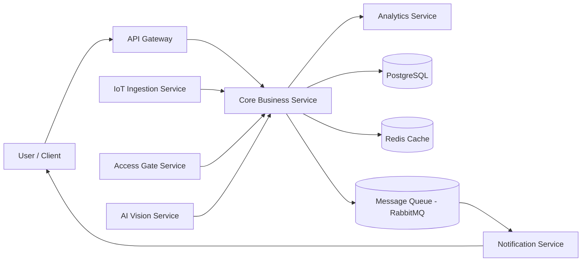

# Service Boundary của nhóm

## 1. Thông tin nhóm

* **Tên nhóm:** (6B)
* **Lớp:** CNTT 17-12
* **Thành viên:** Trương Hữu Vinh, Đỗ Quang Minh, Đinh Ngọc Chính, Hà Quang Dự
* **Service nhóm phụ trách:** Core Business Service (Xử lý nghiệp vụ trung tâm)
* **Sản phẩm tổng thể của lớp:** Hệ thống Smart Campus Ecosystem (hệ sinh thái campus thông minh)

---

## 2. Actor

Các đối tượng tương tác với service:

* **Sinh viên**

  * Đăng ký khóa học
  * Xem thông tin khóa học
  * Gửi yêu cầu nghiệp vụ

* **Giảng viên**

  * Tạo / cập nhật nội dung khóa học
  * Xem danh sách sinh viên

* **Admin**

  * Quản lý hệ thống
  * Phê duyệt / kiểm soát dữ liệu

* **Các service khác (internal)**

  * Auth Service (xác thực)
  * Notification Service (gửi thông báo)

---

## 3. System Boundary

### Nhóm em xây phần nào?

Nhóm phụ trách **Core Business Service** – trung tâm xử lý logic nghiệp vụ

---

### Phần nhóm kiểm soát:

* Xử lý logic nghiệp vụ chính của hệ thống
* Kiểm tra dữ liệu đầu vào hợp lệ
* Xử lý đăng ký khóa học
* Quản lý trạng thái nghiệp vụ
* Tương tác với database
* Gọi các service khác khi cần

---

### Phần nhóm chỉ tích hợp:

* Auth Service (xác thực người dùng)
* Notification Service (gửi email/thông báo)
* API Gateway (định tuyến request)
* Frontend (Web/Mobile)

---

## 4. Service Boundary

### Service của nhóm có trách nhiệm gì?

* Xử lý logic nghiệp vụ trung tâm
* Điều phối luồng xử lý giữa các service
* Quản lý dữ liệu nghiệp vụ (course, enrollment, user action)
* Kiểm tra điều kiện nghiệp vụ (ví dụ: đủ điều kiện đăng ký)
* Trả kết quả xử lý cho client hoặc service khác

---

### Service KHÔNG làm gì?

* Không xử lý giao diện người dùng (UI)
* Không xác thực người dùng (do Auth Service đảm nhiệm)
* Không gửi email/thông báo (do Notification Service đảm nhiệm)
* Không trực tiếp quản lý API Gateway

---

## 5. Input / Output

### Input

* HTTP request từ client (JSON)
* Request từ các service khác
* Dữ liệu xác thực (token từ Auth Service)

Ví dụ:

* Đăng ký khóa học
* Lấy danh sách khóa học
* Gửi yêu cầu xử lý nghiệp vụ

---

### Output

* JSON response trả về client
* Trạng thái xử lý (success / fail)
* Dữ liệu nghiệp vụ (course, user, enrollment)
* Gửi event sang service khác (nếu có)

---

## 6. API dự kiến

| Method | Endpoint      | Mục đích                    |
| ------ | ------------- | --------------------------- |
| GET    | /health       | Kiểm tra trạng thái service |
| GET    | /courses      | Lấy danh sách khóa học      |
| GET    | /courses/{id} | Lấy chi tiết khóa học       |
| POST   | /courses      | Tạo khóa học mới            |
| POST   | /enroll       | Đăng ký khóa học            |
| GET    | /enrollments  | Xem danh sách đăng ký       |
| PUT    | /courses/{id} | Cập nhật khóa học           |
| DELETE | /courses/{id} | Xóa khóa học                |

---

## 7. Phụ thuộc service khác

### Service này kết nối tới

| Service               | Mục đích                                                                    |
| --------------------- | --------------------------------------------------------------------------- |
| IoT Ingestion Service | Nhận dữ liệu cảm biến (nhiệt độ, độ ẩm, trạng thái thiết bị, v.v.)          |
| Access Gate Service   | Nhận sự kiện ra/vào (check-in/check-out, quẹt thẻ, nhận diện)               |
| AI Vision Service     | Nhận kết quả phân tích hình ảnh (nhận diện khuôn mặt, phát hiện bất thường) |
| Notification Service  | Gửi cảnh báo hoặc thông báo đến người dùng (email, app, SMS)                |
| Analytics Service     | Cung cấp dữ liệu phục vụ phân tích, ra quyết định và cảnh báo nâng cao      |

---

### Service khác gọi đến service này

| Service                 | Mục đích                                                             |
| ----------------------- | -------------------------------------------------------------------- |
| API Gateway             | Chuyển tiếp request từ client đến Core Business Service              |
| Frontend (Web/Mobile)   | Gửi yêu cầu nghiệp vụ (đăng ký, truy vấn dữ liệu, thao tác hệ thống) |
| Các service nội bộ khác | Gửi request cần xử lý logic nghiệp vụ trung tâm                      |

---

### Vai trò của Core Business Service trong hệ thống

* Là trung tâm xử lý và điều phối dữ liệu từ nhiều nguồn khác nhau
* Tổng hợp dữ liệu từ IoT, AI, Access để đưa ra quyết định nghiệp vụ
* Kích hoạt các hành động như gửi cảnh báo thông qua Notification Service
* Cung cấp dữ liệu đã xử lý cho Analytics Service phục vụ phân tích

---

## 8. Sơ đồ minh họa (Kiến trúc Microservice – Core Business)

---

### 🔍 Giải thích sơ đồ (ngắn gọn nhưng đủ điểm)

* **API Gateway**: tiếp nhận request từ người dùng và chuyển vào hệ thống
* **Core Business Service**: trung tâm xử lý toàn bộ logic nghiệp vụ
* **IoT / Access / AI Vision**: cung cấp dữ liệu đầu vào từ cảm biến, cổng ra vào, hệ thống AI
* **PostgreSQL**: lưu trữ dữ liệu chính
* **Redis**: cache tăng tốc xử lý
* **RabbitMQ**: xử lý bất đồng bộ (event-driven)
* **Notification Service**: gửi cảnh báo/thông báo đến người dùng
* **Analytics Service**: nhận dữ liệu để phân tích và hỗ trợ ra quyết định

---

### 🔥 Luồng hoạt động chính

1. User gửi request → API Gateway
2. Gateway chuyển vào Core Service
3. Core:

   * Nhận thêm dữ liệu từ IoT / Access / AI
   * Xử lý logic nghiệp vụ
4. Core:

   * Lưu DB + cache Redis
   * Gửi event qua RabbitMQ
5. Notification gửi cảnh báo cho User
6. Analytics nhận dữ liệu để phân tích

---
